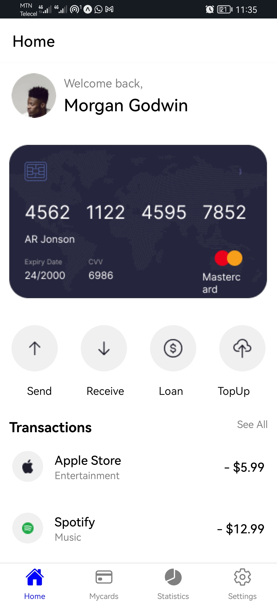
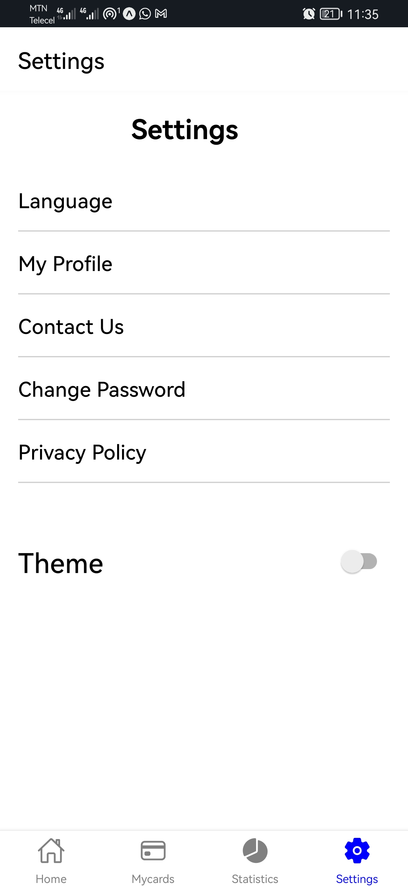
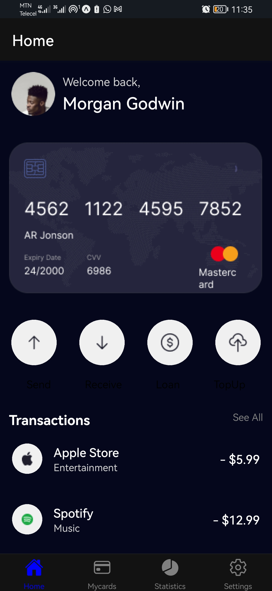
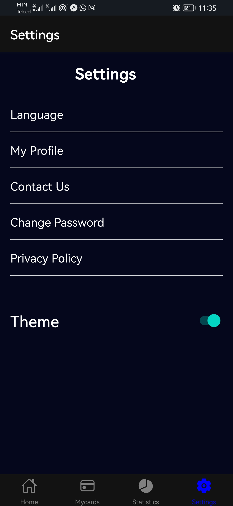

# rn-assignment5-11079266

---

# Mobile App with Theme Switching

## Components

- **App**: Main component rendering the bottom tab navigator.
- **AppThemeProvider**: Context provider managing theme state.
- **useAppTheme**: Hook for consuming theme context across components.
- **BottomTabNavigator**: Navigation component with tabs for Home, My Cards, Statistics, and Settings.
- **Pages**: Individual screens for each tab (e.g., HomePage, MycardsPage, StatisticsPage, SettingsPage).

## Purpose

This mobile app showcases theme switching functionality using React Native and React Navigation. It allows users to toggle between light and dark themes for a personalized user experience.

## Usage

1. **Installation**:
   - Clone the repository and navigate to the project folder.
   - Run `npm install` to install dependencies.

2. **Run the App**:
   - Start Metro Bundler with `npm start`.
   - Launch the app on a simulator or device using Expo Go or Xcode/Android Studio.
   - Alternatively, scan the QR code from Metro Bundler using the Expo Go app.

3. # screenshot

---

